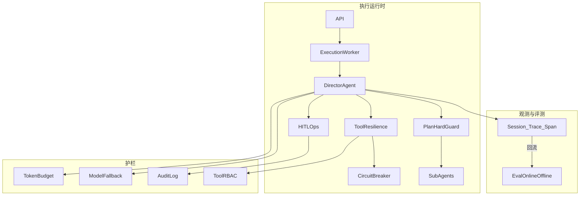

# 多 Agent 系统企业级打磨计划

## 目标边界

- **做**：编排、观测、评测、弹性、HITL 运营、成本、安全、版本、流式、测试；在现有 `port/core/adapter/server` 分层内演进。
- **不做**：RAG / 向量检索 / GraphRAG / Wiki 内容与索引；知识库统一由独立项目 `E:\个人项目\knowledge-hub` 演进，本仓仅保持现有知识工具适配点不变。
- **前提**：企业级 P0（Postgres/Redis 硬依赖、租户隔离、durable HITL、DAG `skipped`、Worker/MQ）已落地；本计划是其上的「眼睛→质量门→护栏」。
- **验证标准**：每阶段结束须 `pnpm build` + `pnpm test` 通过，并至少一条 design / query / HITL happy path；原子提交、不混入无关文档大改。

## 现状锚点（事实面）

| 已有                                                                                             | 偏弱 / 缺失                                                                             |
| ---------------------------------------------------------------------------------------------- | ----------------------------------------------------------------------------------- |
| Port-Adapter 分层、Director/Planner/Router、DAG、durable HITL、Worker/MQ、多租户鉴权、配置 fail-fast、SSE 事件协议 | Trace 九态落库、Eval、模型 Fallback、工具熔断四策略、Token 硬预算、审计、工具权限分级、会话级版本、Plan 硬保障、跨 Agent 失控防护 |

对照面试题体系（观测 Q3、评测 Q4–Q5、工具弹性 Q6、HITL Q8、护栏 Q10、成本 Q12–Q13/Q18–Q19、多 Agent Q14/Q29、版本 Q20），本仓缺口集中在 **可观测资产 + 可评测闭环 + 弹性/成本/安全护栏**。

## 目标运行增强（概念）

## 阶段划分（约 90 天）

### 阶段 A · P0（第 1–3 周）：能看见、不烧钱、挂了能降级

#### A1. Trace 三层 + 九态 Span 落库

- 在 `port/tracing` 落地可注入实现；Span 九态对齐 ReAct 阶段（推理前/后、工具前/后、总结前/后、调用前/后/错误），写入即不可变。
- Postgres 表存 Session / Trace / Span；Director / LangGraphAgentAdapter / 工具执行路径埋点；预留 OTel Exporter 接口（本阶段可不接 Collector）。
- **验收**：一次 design 跑完可按 `traceId` 点查完整链路；跨子 Agent 调用可见父子 Span。

#### A2. Token 硬预算 + 死循环止血

- per-trace Token 硬上限（配置进 `FrameworkConfig` + `.env.example`）；超限截断或终止，记入 Span。
- 最近 K 轮 `(toolName, paramsHash)` 去重计数超阈值 → 强制中断并 fail loud。
- 与现有 `maxIterations`、任务超时取最先到者。
- **验收**：构造死循环用例被硬停；超预算有可审计终止原因。

#### A3. 模型 Fallback 链

- 配置 primary / fallback 模型列表；触发：超时、429、连续失败（熔断 Open）。
- 对上层 Agent 透明；切换事件写入 Trace。
- **验收**：主模型不可用时自动切备模完成一次 query；无备模时明确告知不可用（非静默空响应）。

#### A4. 工具失败四策略 + 熔断

- 框架定义决策类型：Retry / ReturnToLLM / Degrade / FastFail；工具声明失败后走哪条路。
- 对外部/MCP 工具加熔断器（Closed → Open → Half-Open）；连续失败达阈值不再白等。
- Span 记录决策与熔断状态变迁。
- **验收**：外部工具持续失败时熔断生效，LLM 收到「工具不可用」观察而非反复超时。

---

### 阶段 B · P1（第 4–6 周）：运营护栏与可靠性

#### B1. Eval V1

- 最小实体：数据集、用例、指标、基线、任务、得分。
- Online：调用 Agent 再评分；Offline：用已落库 Trace 输出复评（零成本回归）。
- 先落地 LLM-as-Judge + 少量精确匹配；设计类 golden（计划合理性、文档结构、关键字段）。
- **验收**：CI 或脚本可跑一小批 Offline 评测并产出报告；Score 可关联 `traceId`。

#### B2. HITL 运营面

- 待审看板 API/前端列表（会话、审阅点、等待时长）。
- 超时策略（升级 / 自动决策 / 过期作废，配置化）。
- resume 防 double-resume（CAS/乐观锁）；恢复前可选新鲜度校验钩子。
- **验收**：超时可触发配置策略；并发双 resume 仅一次成功。

#### B3. 审计日志 + 工具权限分级

- `audit_logs` 表：登录、配置变更、HITL 决策、高危工具调用。
- 工具分级：只读 / 写入 / 不可逆；不可逆默认强制 HITL。
- 参数沙箱策略配置化（路径、危险操作关键字等，与现有 Workspace sanitize 对齐）。
- **验收**：高危工具未审批不可执行；关键操作可按 userId 审计查询。

#### B4. 成本归因 + RPM/TPM 限流

- 按 userId / agent / workflow 聚合 token 与估算费用（基于 Trace 计量）。
- RPM + TPM 双限流；每用户隔舱（防单用户占满）。
- **验收**：限流触发有明确错误码；看板能回答「谁在烧钱」。

#### B5. Saga 最小集 + 协作式取消

- 有副作用工具可选声明 `compensate`；失败逆序补偿，补偿失败进人工/告警队列。
- 取消为协作式：推理前/工具前/工具后检查标志；已提交步骤标记并回传部分结果。
- **验收**：取消后前端看到「已完成步骤 + 明确未完成项」；可补偿工具失败触发 compensate。

---

### 阶段 C · P2（第 7–10 周）：编排与发布成熟度

#### C1. Prompt / Skill / Workflow 版本化

- 会话创建时绑定当前活跃版本快照；执行全程用该版本（MVCC 语义）。
- 发布：`isActive` + 灰度比例（userId hash / 白名单）；回滚切标志位，秒级生效。
- 工具删改保留历史版本直至无 in-flight 引用（或 TTL）。
- **验收**：灰度期间新旧版本并存；回滚不影响已绑定旧版本的 in-flight 会话。

#### C2. Plan 硬保障

- 代码驱动步骤推进（不仅依赖提示注入）；步骤级工具白名单。
- 最大重规划次数；偏离可审计。
- **验收**：跳步/越权工具调用被框架拒绝；超重规划次数终止。

#### C3. 跨 Agent 失控防护 + Handoff

- 跨 Agent 全局 Token 预算、fan-out/递归深度上限、互相调用环检测。
- Handoff 协议：子 Agent 只回传蒸馏结论 + schema，禁止灌全量轨迹。
- **验收**：构造互相调用环被检测中断；子 Agent 回传体积受 schema 约束。

#### C4. 记忆驱逐前摘要 + SSE 产品化

- 滑窗驱逐前必须摘要入归档（不论是否超预算）；保护最近 N 轮原文。
- SSE：心跳 comment 帧；执行与连接解耦（断连不杀 Worker）；重连以任务/执行状态恢复为主（不做 token 级全量持久化）。
- **验收**：长会话裁剪后归档可查；断连后任务仍完成，刷新可拉最终结果。

---

### 阶段 D · P3（第 11–12 周）：工程兑现

#### D1. 结构化输出闭环 + MCP 治理

- Schema 强校验 → 带具体错因重试 → 降级或 HITL；永不信任 LLM 输出直进下游。
- MCP：按 Skill/工具组按需暴露描述；超时/熔断/权限与进程内工具同一策略面。
- **验收**：非法 JSON 不进入业务写路径；MCP 工具故障走与本地工具相同的四策略。

#### D2. e2e + 第二适配器 PoC（可选）

- Playwright（或等价）覆盖：登录 → design → HITL → 完成；进 CI。
- 可选：Mock/轻量第二 `AgentPort` 适配器 + 同一 Trace/Eval 对比，兑现可拔插叙事。
- **验收**：e2e 稳定绿；可选 PoC 证明业务 Tool/Eval 零改动可换引擎入口。

## 明确不做（本计划全程）

- 向量索引、混合检索、Rerank、HyDE、RAGAS、GraphRAG 索引流水线
- `knowledge-hub` 引擎改造、Wiki 内容策展与互链维护闭环（归知识库项目）
- 私有化推理栈（vLLM/量化/PD 分离）——若未来内网部署另立计划
- Time-travel 完整产品化（历史 fork 重放）——可在 Trace/Checkpoint 完善后单独立项

## 原子提交约定

- 每个 todo 对应 1～N 个原子 commit，主题单一（如 `feat: Trace Span 落库`、`feat: 工具熔断四策略`）。
- 同步修改配置三件套：`FrameworkConfig` + `loadConfig` + `.env.example`。
- 严守分层：core 不依赖 adapter；提示词/密钥不硬编码进 core。
- 不混入 `dist/`、密钥、`.cursor` 计划文件以外的无关大改。

## 建议开工顺序（立刻可拆）

1. **A1 Trace 落库** — 后续 Eval/成本/熔断全依赖它
2. **A2 Token 硬预算 + 循环检测** — 防生产烧钱
3. **A3 模型 Fallback** — 可用性
4. **A4 工具四策略 + 熔断** — 弹性
5. 再进入 B1 Eval V1 …

## 成功标准（计划完成时）

- 任意一次 Agent 执行可按 `traceId` 复盘九态链路，并支持 Offline 评测关联。
- 死循环 / 超预算 / 主模型不可用 / 外部工具持续失败均有硬护栏且 fail loud。
- HITL、高危工具、配置变更可审计；Prompt/Skill/Workflow 变更可灰度与回滚。
- 知识库行为不因本计划发生破坏性变更；对接 `knowledge-hub` 的既有工具契约保持稳定。

