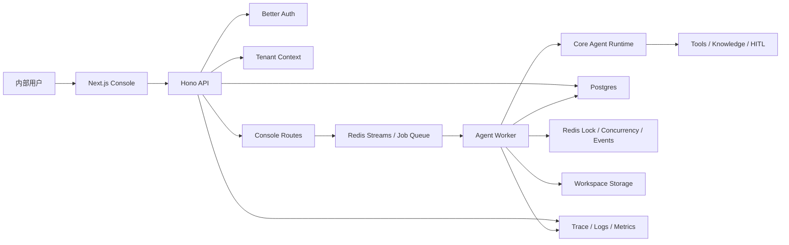

# 公司内部云端部署进一步开发方案

> 生成日期：2026-06-09  
> 依据文档：`docs/project-overview-cloud-readiness.md`  
> 目标场景：部署到公司云服务器，供内部多用户使用；优先保障安全、隔离、稳定与可运维性，而不是立即做开放式 SaaS。

## 1. 总体目标

把当前“本地单用户可用 + 多用户基础设施雏形”的多 Agent 游戏策划系统，推进到“公司内部可登录、多用户隔离、任务可追踪、数据可持久化、可灰度上线”的云端 Beta。

本阶段不建议一口气做成完整商业 SaaS。更稳妥的目标是：

- 内部用户可以通过账号登录使用控制台。
- 用户只能访问自己的会话、输出、设置和资产。
- 系统支持在云服务器或容器环境中稳定重启、升级和备份。
- 长任务不会因为浏览器断开或后端实例重启而完全丢失。
- 管理员能看到用户、任务、错误、成本和关键审计记录。

## 2. 建设原则

### 2.1 安全默认开启

除健康检查、静态资源和 Better Auth 认证端点外，所有业务 API 默认要求登录。任何新 route 都应显式选择“公开”或“需要鉴权”，避免匿名访问成为默认行为。

### 2.2 租户隔离贯穿主路径

`tenantId`、`userId`、`sessionId` 应成为 console、sessions、workspace、settings、prompts、skills、workflows、HITL、queue、trace 的共同上下文。禁止只在认证层解析租户，但业务层继续读写全局文件。

### 2.3 云端先单集群，后横向扩容

第一阶段先支持一套内部环境稳定运行：一组 backend、frontend、Postgres、Redis。待数据模型和任务状态机稳定后，再扩展多 worker、多实例和自动伸缩。

### 2.4 保持端口-适配器边界

继续遵守项目现有架构规范：

- `src/core/` 只依赖 `src/port/`。
- `src/adapter/` 负责 Better Auth、Postgres、Redis、对象存储等具体实现。
- `src/server/` 作为组装根，负责创建适配器并注入核心逻辑。
- `src/config/` 只定义和加载配置，不实例化 adapter。

## 3. 目标架构



核心变化是把“HTTP 请求内直接执行 Agent”逐步变成“API 创建任务、Worker 执行任务、前端订阅事件”。这样才能支撑多用户、长任务、取消、重试、断线恢复和横向扩容。

## 4. 技术栈与中间件评估

### 4.0 小规模内部使用结论

本项目目标用户规模不到 100 人，且使用场景是公司内部云服务器，不建议继续增加新的中间件。当前依赖组合已经足够支撑内部 Beta：

- Postgres：用户、会话、任务、审计、设置等结构化数据。
- Redis：登录态辅助、并发控制、后续 Redis Streams 任务队列。
- Better Auth：内部账号登录与会话管理。
- Drizzle ORM：Postgres schema 与 migration 治理。
- Hono + Next.js：后端 API 与前端控制台。

暂不需要引入 Kafka、RabbitMQ、BullMQ、Kubernetes、MinIO/S3、Vault/KMS、独立 OpenTelemetry Collector、服务网格或多租户 SaaS 级网关。对于不到 100 人的内部使用，这些组件会显著增加部署、排障和维护成本，收益不足。

必须补齐但不需要新增 npm 依赖的能力：

- HTTPS 与反向代理：用云服务器现有 Nginx/Caddy/负载均衡处理。
- 数据备份：Postgres 定时备份，Redis 只作为缓存/队列可按需持久化。
- 日志保留：先使用容器日志和云服务器日志采集。
- 资源限制：用 Redis 计数和应用配置实现用户并发限制。
- 文件输出：第一版用本机 volume + tenant/user/session 路径隔离，暂不接对象存储。

### 4.1 建议引入：Drizzle ORM

建议引入 Drizzle ORM 作为 Postgres schema 与 migration 工具链，但使用边界必须收敛在 `src/adapter/postgres/` 和仓库根目录的迁移配置中。

引入原因：

- 当前已有 `pg` 与 Postgres adapter，但 schema 初始化仍依赖手写 `CREATE TABLE IF NOT EXISTS`，不利于云端多用户上线后的版本化升级。
- 多用户化会继续增加 `tasks`、`review_records`、`user_settings`、`workspace_assets`、`audit_logs` 等表，需要一个 TypeScript schema source of truth。
- Drizzle 足够轻量，可以只用于 adapter 层和 migration，不要求 core 层接受 ORM 模型。

边界约束：

- `src/core/` 和 `src/port/` 不 import Drizzle。
- `DatabasePort` 继续保持简单 SQL 查询端口。
- Better Auth 自己管理的 `"user"` / `"session"` 表不由本项目 Drizzle schema 接管。
- 迁移文件必须作为云端部署的一部分执行，不能继续依赖启动时隐式建表。

### 4.2 暂不引入：BullMQ

当前项目已经有 Redis Streams 方向的 queue adapter。内部 Beta 阶段建议先把已有 Redis Streams 接入任务主链路，而不是立即引入 BullMQ。等任务重试、延迟任务、优先级队列、可视化管理等需求明确后，再评估是否替换或并行引入。

### 4.3 暂不引入：Prisma / TypeORM

Prisma 和 TypeORM 对本项目当前目标偏重。项目已有端口-适配器边界和 `DatabasePort`，现阶段需要的是 schema/migration 治理，而不是把业务层迁移到完整 ORM 实体模型。

### 4.4 延后引入：对象存储与 KMS

对象存储和密钥管理是生产需要，但不是第一刀：

- Workspace 第一阶段先做 `tenantId/userId/sessionId` 路径隔离和访问校验。
- 第二阶段再抽象对象存储 adapter，接入 S3、MinIO 或云厂商 OSS。
- 敏感 key 第一阶段可使用应用层加密和环境 secret；后续再接云厂商 KMS。

## 5. 阶段路线图

### 阶段 0：上线前基线整理

目标：确认当前代码可以稳定构建，并把开发边界固化下来。

建议周期：1-2 天。

交付物：

- 架构评估文档已完成：`docs/project-overview-cloud-readiness.md`。
- 本开发方案文档。
- 当前主分支可通过 TypeScript 构建。
- 明确内部 Beta 不支持的能力清单，例如公开注册、外部租户、计费、多地域部署。

验收标准：

- `pnpm run build` 通过。
- README 不作为唯一事实来源，后续以 `docs/` 下评估和方案文档为准。
- Git 提交按原子性分组，文档、认证、部署、队列等变更分别提交。

### 阶段 1：封闭式单实例云端部署

目标：先把系统稳定部署到公司云服务器，供少量可信内部用户试用。

建议周期：3-5 天。

开发范围：

1. 生产配置治理
   - 新增 `.env.production.example`。
   - 在 `src/config/FrameworkConfig.ts` 增加生产必填项类型。
   - 在 `src/config/loadConfig.ts` 增加生产环境校验。
   - 启动时拒绝 `BETTER_AUTH_SECRET=change-me-in-production`、空模型 key、空数据库连接串等危险配置。

2. Docker 与 Compose 改造
   - 后端 Dockerfile 改为多阶段构建：安装依赖、构建、复制产物、运行。
   - 前端 Dockerfile 改为容器内构建，不依赖宿主机 `.next/standalone`。
   - `docker-compose.yml` 增加 Postgres、Redis、healthcheck、volume、network。
   - 增加 `docker-compose.prod.yml` 或部署样例，区分本地开发和生产。

3. 生产 CORS 与反向代理
   - 新增 `ALLOWED_ORIGINS` 配置。
   - 后端 CORS 从 `origin: "*"` 改为白名单。
   - 明确 Nginx/Caddy/云负载均衡的 HTTPS、超时和 SSE 配置。

4. 健康检查
   - `/health` 返回进程存活。
   - `/ready` 检查 Postgres、Redis、关键配置和模型 provider 可用性。

建议提交：

- `chore: add production config validation`
- `chore: add cloud compose services`
- `fix: restrict production cors`

验收标准：

- 云服务器上可以通过容器启动 backend、frontend、Postgres、Redis。
- 生产环境危险默认值会启动失败。
- 前端可以访问后端，SSE 不被代理中断。
- 服务重启后数据仍保存在 Postgres/volume 中。

### 阶段 2：认证接入与业务 API 默认保护

目标：内部用户必须登录后才能使用业务功能，匿名用户无法访问会话、设置、资产和 Agent 执行入口。

建议周期：4-7 天。

开发范围：

1. 后端默认鉴权
   - 保留公开路由：`/health`、`/ready`、`/api/auth/*`。
   - 保护路由：`/api/console/*`、`/api/sessions/*`、`/api/settings/*`、`/api/prompts/*`、`/api/skills/*`、`/api/workflows/*`、`/api/reviews/*`。
   - 当前 `authMiddleware` 只解析上下文还不够，需要增加“未登录直接 401”的默认策略。

2. 前端登录态
   - `frontend/lib/api.ts` 的 fetch 默认增加 `credentials: "include"`。
   - 增加登录页、退出入口、用户菜单、未登录跳转。
   - 前端对 401 做统一处理，避免控制台静默失败。

3. 用户初始化
   - 内部系统建议第一版关闭公开注册。
   - 由管理员创建账号，或接入公司已有身份源。
   - 若短期使用 Better Auth 邮箱密码模式，应加入“首个管理员初始化”脚本。

4. 权限模型最小化
   - 先支持 `admin` 和 `user` 两类角色。
   - `admin` 可管理用户、查看系统任务和全局配置。
   - `user` 只能访问自己的资源。

建议提交：

- `feat: require auth for business api routes`
- `feat: add console login flow`
- `feat: add internal user bootstrap`

验收标准：

- 未登录访问业务 API 返回 401。
- 登录后前端能正常执行 design/query/table。
- A 用户无法读取 B 用户 session、workspace 输出和设置。
- 管理员入口只允许 admin 访问。

### 阶段 3：会话、工作区、设置多用户化

目标：消除关键全局状态，把用户数据迁移到可隔离、可备份、可审计的存储模型。

建议周期：1-2 周。

开发范围：

1. Session 主路径迁移到 Postgres
   - 将 `/api/console`、`/api/sessions` 从文件型 `SessionManager` 迁移到 `SessionRepository`。
   - 所有查询条件带上 `tenantId` 和 `userId`。
   - session 事件、最终输出、状态、错误信息持久化。

2. Workspace 租户隔离
   - 本阶段可继续使用本地磁盘，但目录必须改为 `workspace/<tenantId>/<userId>/<sessionId>`。
   - 所有下载、读取、删除操作必须校验资源归属。
   - 后续可替换为 S3/MinIO/OSS adapter。

3. Settings 用户级存储
   - 停止让普通用户修改全局 `.env`。
   - 用户模型 provider、API key、Tavily key 等改为用户级或组织级配置。
   - 敏感字段加密存储，响应时只返回掩码。

4. Prompt/Skill/Workflow 作用域
   - 第一版分为 system 和 user 两级。
   - system 资产只读，由代码仓库或管理员维护。
   - user 资产可复制、编辑、删除，且只能本人访问。

建议提交：

- `feat: persist console sessions in postgres`
- `feat: scope workspace files by tenant`
- `feat: store user settings securely`
- `feat: scope prompts skills and workflows`

验收标准：

- 删除本地 `sessions/sessions.jsonl` 后系统仍可使用历史会话。
- 普通用户无法修改全局 `.env`。
- 会话列表、文件面板、设置页都按用户隔离。
- 敏感 key 不会明文出现在 API 响应、日志和前端状态中。

### 阶段 4：异步任务、取消、恢复与并发控制

目标：Agent 长任务脱离 HTTP 请求生命周期，支持多用户并发、取消、重试和断线恢复。

建议周期：1-2 周。

开发范围：

1. 任务模型
   - 新增任务状态：`queued`、`running`、`waiting_hitl`、`completed`、`failed`、`cancelled`。
   - 任务记录包含 `tenantId`、`userId`、`sessionId`、`mode`、`input`、`createdAt`、`startedAt`、`finishedAt`、`errorCode`。

2. API 入队
   - `/api/console/execute` 创建 session/task 并写入 Redis Streams。
   - 立即返回 `taskId` 和 `sessionId`。
   - `/api/console/execute/stream` 改为订阅任务事件，而不是直接执行 Agent。

3. Worker 执行
   - Worker 消费 Redis Streams。
   - 执行过程中持续写入 Postgres session events。
   - 任务失败时记录结构化错误，支持有限次数重试。

4. 分布式取消
   - 取消请求写入任务状态，并通过 Redis pub/sub 或任务状态轮询通知 worker。
   - 替换当前进程内 `activeControllers` 的单实例限制。

5. 并发与配额
   - 使用 Redis 记录用户级并发任务数。
   - 第一版建议默认每用户最多 1-2 个运行中任务。
   - 记录模型调用次数、token 估算、Tavily 调用次数和工具耗时。

建议提交：

- `feat: add postgres task state model`
- `feat: enqueue console executions`
- `feat: add agent worker runner`
- `feat: support distributed task cancellation`
- `feat: enforce user concurrency limits`

验收标准：

- 浏览器关闭后，任务继续执行。
- 页面刷新后，可以恢复查看任务进度和历史输出。
- 后端多实例时，同一用户并发限制仍生效。
- 取消任务不会继续写入大量后续事件。

### 阶段 5：HITL 审计与内部协作

目标：让人工审批在多用户环境中可追踪、可授权、可复盘。

建议周期：4-7 天。

开发范围：

1. Review 数据持久化
   - 审阅点、待审内容、审批结果、审批人、审批时间写入 Postgres。
   - 审批结果关联 taskId/sessionId。

2. 权限控制
   - 普通用户只能审批自己的任务。
   - admin 可以查看和处理全局卡住的任务。

3. 审计记录
   - 记录审批前后 diff 或摘要。
   - 记录 fallback 审批和超时自动处理。

4. 前端体验
   - Review 页面按状态筛选：待我处理、已完成、失败、超时。
   - 从 session timeline 可以跳转到对应 review 记录。

建议提交：

- `feat: persist hitl review records`
- `feat: enforce review ownership`
- `feat: add review audit trail`

验收标准：

- 每个 HITL 决策都能查到审批人和时间。
- 用户不能审批别人的任务。
- 超时、fallback、拒绝和修改都有审计记录。

### 阶段 6：可观察性、管理后台与运维闭环

目标：内部上线后，管理员能定位问题、控制成本、审计行为。

建议周期：1-2 周。

开发范围：

1. 主链路 trace
   - 为每个 task/session 生成 traceId。
   - Agent 规划、路由、子 Agent、工具调用、模型调用、HITL、文件写入都记录 span。
   - 接入现有 `o11y/` 子系统或先输出结构化日志。

2. 错误分类
   - 统一错误码：`AUTH_REQUIRED`、`FORBIDDEN`、`CONFIG_INVALID`、`MODEL_RATE_LIMITED`、`TOOL_TIMEOUT`、`TASK_CANCELLED`、`INTERNAL_ERROR`。
   - 前端按错误码展示可理解的提示。

3. 管理后台
   - 用户列表、禁用用户、重置密码或邀请链接。
   - 任务列表、失败任务、运行中任务、取消任务。
   - 配额与成本统计。

4. 运维脚本
   - 数据库备份和恢复说明。
   - 日志轮转和保留周期。
   - 部署回滚步骤。

建议提交：

- `feat: add task trace context`
- `feat: classify api and runtime errors`
- `feat: add admin operations dashboard`
- `docs: add operations runbook`

验收标准：

- 一次失败任务可以从前端定位到后端日志和 trace。
- 管理员可以禁用异常用户。
- 可以按用户统计任务量和大致模型成本。
- 有可执行的备份、恢复、回滚文档。

## 6. 数据模型建议

第一版建议围绕以下实体建模：

| 实体 | 关键字段 | 说明 |
|---|---|---|
| user | id, email, name, role, status | Better Auth 用户与业务角色扩展 |
| tenant | id, name, status | 内部部署可先只有一个默认 tenant |
| user_settings | userId, provider, encryptedApiKey, tavilyKey | 用户级模型与工具配置 |
| sessions | id, tenantId, userId, title, mode, status | 控制台会话主表 |
| session_events | id, sessionId, type, payload, createdAt | 流式事件与 timeline |
| tasks | id, tenantId, userId, sessionId, status, input | 异步执行任务 |
| review_records | id, taskId, sessionId, reviewerId, decision | HITL 审计 |
| workspace_assets | id, tenantId, userId, sessionId, path, mimeType | 输出文件索引 |
| audit_logs | id, actorId, action, targetType, targetId | 管理与安全审计 |

内部 Beta 可以先只启用一个默认 tenant，但代码和数据库应从第一天保留 `tenantId`，避免后续重构。

## 7. API 策略

### 7.1 路由分级

公开路由：

- `GET /health`
- `GET /ready`
- `/api/auth/*`

登录后可访问：

- `/api/console/*`
- `/api/sessions/*`
- `/api/settings/*`
- `/api/prompts/*`
- `/api/skills/*`
- `/api/workflows/*`
- `/api/reviews/*`

管理员访问：

- `/api/admin/users/*`
- `/api/admin/tasks/*`
- `/api/admin/audit/*`
- `/api/admin/settings/*`

### 7.2 默认响应规范

建议统一错误响应：

```json
{
  "error": {
    "code": "FORBIDDEN",
    "message": "You do not have access to this resource.",
    "traceId": "trace_..."
  }
}
```

前端不要直接展示后端异常栈；traceId 给管理员排查使用。

## 8. 测试策略

### 8.1 必须补齐的自动化测试

- 未登录访问业务 API 返回 401。
- A 用户无法读取 B 用户 session。
- A 用户无法下载 B 用户 workspace asset。
- 用户 API key 响应被掩码。
- 生产环境危险 secret 启动失败。
- Redis 并发限制在多请求下有效。
- 任务入队后 worker 可以执行并写入事件。
- 取消任务后状态变为 `cancelled`，worker 停止后续写入。

### 8.2 内部上线前手工验收

每次部署前至少跑通：

1. admin 创建或邀请用户。
2. user 登录。
3. user 跑一条 query。
4. user 跑一条 design。
5. user 跑一条 table。
6. user 下载或查看 workspace 输出。
7. user 刷新页面后恢复历史会话。
8. admin 查看任务与错误日志。
9. 禁用 user 后，该用户无法继续调用业务 API。

## 9. 推荐里程碑

### M1：内部单实例可部署

完成阶段 1。

结果：系统可以稳定运行在云服务器上，但只建议小范围可信用户试用。

### M2：登录与数据隔离可用

完成阶段 2 和阶段 3。

结果：公司内部多用户 Beta 可以开始，核心安全边界成立。

### M3：长任务与多实例基础可用

完成阶段 4。

结果：Agent 执行不再依赖单个 HTTP 请求，具备横向扩展基础。

### M4：内部生产可运营

完成阶段 5 和阶段 6。

结果：具备审计、观测、管理、备份和回滚能力，可以支撑团队日常使用。

## 10. 风险与取舍

### 最大技术风险

- 文件型 session/settings/workspace 与多用户模型冲突。
- 认证接入后，前端已有调用路径可能大量暴露 401/403 处理缺口。
- Agent 长任务如果继续绑定 HTTP 请求，会限制云端稳定性。
- 配置密钥如果继续写入全局 `.env`，会带来内部数据泄漏风险。

### 建议取舍

- 第一版不做公开注册，降低账号滥用和安全面。
- 第一版 tenant 可以只有一个，但所有表和 API 都带 tenantId。
- 第一版 workspace 可以仍用本地磁盘，但目录和访问必须按用户隔离。
- 第一版可观察性可以先用结构化日志，再逐步接入完整 o11y。
- 第一版模型成本可以先估算，不必立即做精确计费。

## 11. 建议下一步

优先启动 M1 和 M2，不建议先做复杂的 Agent 能力扩展。

最小可上线开发顺序：

1. 生产配置校验与 Docker/Compose 改造。
2. 业务 API 默认鉴权。
3. 前端登录态与 `credentials: "include"`。
4. session 主路径迁移 Postgres。
5. workspace 和 settings 用户隔离。
6. 内部 Beta 验收脚本。

完成这 6 项后，系统才适合放到公司云服务器给多人试用。随后再做异步 worker、HITL 审计、管理后台和完整可观察性。
