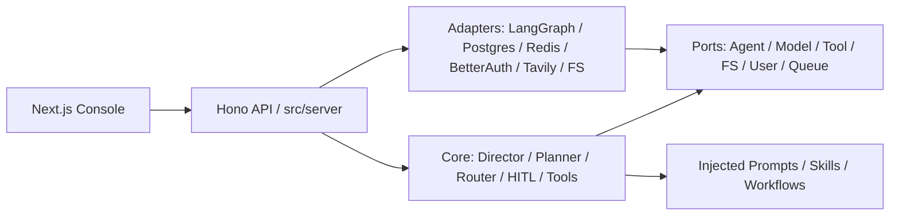

# 多智能体游戏策划系统项目概况与云端多用户部署评估

> 生成日期：2026-06-09  
> 依据范围：当前代码、配置、Docker、前端 API、测试目录与 CodeGraph 索引；`README.md` 未作为主要事实来源。

> ⚠️ **快照过时声明（2026-08-08 更新）**：本文是 2026-06-09 的历史快照，文中多数"工程缺口"此后已关闭。当前事实以 `README.md` 与代码为准。已关闭项速查：
> - **认证**：`requireAuth()` 已默认保护全部 `/api/*`（`src/server/app.ts:84`），匿名请求 401；CORS 已用 localhost 白名单（非 `origin: '*'`）。
> - **会话持久化**：主路径为 Postgres `SessionRepository`（`src/server/bootstrap.ts:823-824`）；文件型 `SessionManager` 已废弃；工作区已租户隔离（`data/users/<userId>/workspace`）。
> - **消息队列**：HTTP 202 → Redis Streams → `ExecutionWorker` 已是任务执行主链；取消/恢复均已持久化；Redis 并发槽位已接入执行入口。
> - **可观测性**：无独立 `o11y/` 子项目（该目录从未存在于本仓）；观测子系统在仓内（`src/core/tracing/` + `/api/traces` + `/api/audit`）。
> - **基础设施**：`docker-compose.yml` 已含 Postgres(pgvector)/Redis/migrate/backend/frontend/prometheus/alertmanager/grafana；表结构仅经 `drizzle/` 迁移，`initializeSchema()` 为无调用方的废弃代码。

## 1. 项目目标

本项目是一个 TypeScript 版本的多智能体游戏策划系统基座，核心目标是把“游戏设计需求”转化为可执行的多角色策划协作流程，并输出策划案、知识查询结果或配表结果。

当前系统支持三类主要工作模式：

- `design`：由主策划统筹，拆解任务并调用多个子 Agent 产出完整设计方案。
- `query`：面向游戏策划知识库的问答/检索模式，支持流式输出。
- `table`：面向游戏配置表、执行策划类输出的任务模式。

系统定位不是一个单一聊天机器人，而是一个“可替换 Agent 框架 + 游戏策划领域知识 + 前端控制台 + 可观察执行过程”的工程基座。它已经具备本地单实例使用和进一步产品化的雏形，但距离真正云端部署、多用户稳定使用仍有明显工程缺口。

## 2. 当前项目组成

### 后端核心

- `src/port/`：端口接口层，定义 Agent、Model、Tool、Session、User、Queue、Tracing、FileSystem 等抽象。
- `src/core/`：框架无关业务层，包含 DirectorAgent、任务规划、路由、整合、HITL、记忆、技能、工具、工作区等核心逻辑。
- `src/adapter/`：具体实现层，包含 LangGraph、Tavily、文件系统、Postgres、Redis、Better Auth、Mock 等适配器。
- `src/server/`：应用组装根与 Hono API，负责加载配置、提示词、技能、工具、适配器并挂载路由。

### 前端控制台

- `frontend/`：Next.js 16 + React 19 控制台。
- 主要页面包含 dashboard、design、query、table、review、logs、settings。
- 主工作台在 `frontend/components/Console/ConsolePage.tsx`，支持会话侧栏、流式输出、步骤时间线、日志、文件面板、设置弹窗。

### 领域资产

- `prompts/`：子 Agent、任务规划、路由、查询等提示词文件。
- `knowledge/`：Wiki 与知识图谱相关资产。
- `contrib/`：技能/工作流扩展资产。
- `workspace/`、`sessions/`：当前本地运行输出与会话持久化目录。

### 可观察性子系统

- 观测能力在仓内实现：`src/core/tracing/`（九态 Session/Trace/Span）+ `src/server/routes/traces.ts` + `/api/audit` + Prometheus `/metrics`（`src/server/app.ts:120`）。
- （本文早期版本提到的独立 `o11y/` Python/Next/Java 子项目不存在于本仓，2026-08-08 核实。）

## 3. 架构概况

整体架构符合 Ports & Adapters 的基本方向：

### 核心流程

1. `bootstrap()` 读取环境配置与 `settings.json`。
2. 在 server 组装根加载 prompts、skills、workflows。
3. 注册知识库工具、图谱工具、Tavily 工具、workspace 工具等。
4. 根据配置创建 LangGraph / Mock 等 Agent 适配器与模型适配器。
5. 创建 `DirectorAgent`，注入模型、AgentFactory、ToolRegistry、SkillRegistry、HITL gateway、hooks、workspace。
6. 前端调用 `/api/console/execute` 或 `/api/console/execute/stream`。
7. Director 根据模式执行：
   - design/table：规划任务、路由到子 Agent、并发或按依赖执行、整合输出。
   - query：直接面向模型与知识上下文做流式回答。
8. Session 与 workspace 输出目前主要写入本地文件。

### 架构健康评价

正向点：

- `src/core/` 主要依赖 `port/`，LangGraph、Better Auth、Redis、Postgres 等被放在 adapter 或 server 层。
- 提示词加载在 `src/server/bootstrap.ts` 里完成，再注入核心对象，避免 core 模块加载时读文件。
- LangGraph 被封装在 `src/adapter/langgraph/`，核心 Agent 逻辑没有直接绑定框架。
- 工具注册和名称映射集中在 `bootstrap()`，符合组装根职责。
- 已经有 hooks、HITL、memory、session、skill、workflow 等扩展点。

风险点：

- 部分 server route 直接使用 `fs`、`path` 操作 prompts/skills/workflows/workspace，这在 server 层可以接受，但未来多用户化时会成为租户隔离与权限审计重点。
- `SettingsManager` 当前是全局 `settings.json`，存储模型密钥等配置，不适合多租户共享环境。
- `SessionManager` 当前是文件型 JSONL，全局可见；虽然已有 `PostgresSessionRepository`，但主路由仍在使用文件型 `SessionManager`。
- 多用户相关适配器已经出现，但尚未完全贯穿 console、sessions、settings、prompts、skills、workflows 等所有业务入口。

## 4. 当前能力成熟度

| 能力 | 当前状态 | 评价 |
|---|---|---|
| 多 Agent 编排 | 已具备 | Director + Planner + Router + 子 Agent + Integrator 结构清晰 |
| 流式输出 | 已具备 | query 为 token/chunk，design/table 为结构化事件 |
| HITL | 基础可用 | 有标准 review point 和 checkpoint 管理，但产品级审计/权限仍不足 |
| 知识库工具 | 已具备 | Wiki、grep、KG、Tavily 可注册给 Agent |
| 技能/工作流 | 已具备 | 可通过文件加载与 UI 修改，适合快速扩展 |
| 前端控制台 | 已具备 | 对单用户本地使用较完整 |
| 长期记忆 | 部分具备 | 文件型 LTM 可用，Postgres LTM schema 有雏形，但未完整替换 |
| 多用户系统 | 雏形 | Better Auth、Redis tenant、Postgres schema 已有，但接入不完整 |
| 消息队列 | 雏形 | Redis Streams adapter 存在，但 console 执行仍是请求内同步执行 |
| 云端容器化 | 本地打包可用 | Dockerfile 依赖本地预编译和 node_modules，不是标准云构建模式 |
| 可观察性 | 并行建设中 | o11y 子系统存在，但主业务链路生产接入仍需补齐 |

## 5. 距离云端部署、多用户使用的主要差距

### P0：安全与租户隔离

1. **大部分业务 API 未强制鉴权**
   - `authMiddleware` 当前只解析 tenant 并写入上下文，匿名请求仍可继续进入后续路由。
   - `requireAuth()` 主要用于 `/api/users/*`，console、sessions、settings、prompts、skills、workflows 等关键路由未统一保护。

2. **前端 API 未携带 Better Auth cookie**
   - `frontend/lib/api.ts` 的 fetch 调用没有 `credentials: 'include'`。
   - 即使后端启用 Better Auth，浏览器端也难以自然维持登录态。

3. **全局配置和密钥不适合多用户**
   - `/api/settings` 修改的是全局 `settings.json`，还会同步 `.env`。
   - 多用户云端环境中，模型 provider、API key、Tavily key 应按用户/组织隔离，并做加密存储、权限控制和审计。

4. **会话与工作区仍是全局文件模型**
   - console 执行写入全局 `sessions/sessions.jsonl`。
   - workspace 输出按 `workspace/<sessionId>` 存放，缺少 userId/tenantId 前缀和访问校验。
   - 只要知道 sessionId，就可能访问或下载他人输出。

5. **CORS 配置不适合生产**
   - Hono app 当前 `origin: "*"` 且 `credentials: true`。
   - 生产应改为显式白名单域名，并区分本地、测试、生产环境。

### P0：数据持久化与并发执行

1. **Postgres 仓储未成为主路径**
   - 已有 `PostgresSessionRepository` 和 schema，但 `/api/console`、`/api/sessions` 仍使用文件型 `SessionManager`。
   - 需要把 SessionPort/Repository 真正接入 console/sessions route。

2. **Redis 并发控制未接入执行入口**
   - `RedisTenantIsolationAdapter` 支持 concurrency counter。
   - 但 `/api/console/execute*` 当前只用进程内 `activeControllers` 防止同 session 重入，无法跨实例限流，也无法按用户限制并发。

3. **消息队列 adapter 未成为任务执行链路**
   - Redis Streams adapter 已实现 publish/subscribe/start。
   - 当前 agent 任务仍在 HTTP 请求生命周期内执行，长任务、断线恢复、横向扩容、失败重试都受限。

### P1：产品化多用户体验

1. **缺少登录/注册/退出的前端产品入口**
   - 后端挂载了 `/api/auth/*`，但前端主控制台没有完整登录态管理、路由保护、用户菜单和错误处理。

2. **缺少用户/组织/角色权限模型**
   - 端口中有 `UserRole` 与 admin route 雏形。
   - 但 settings、prompt、skill、workflow、knowledge asset 的读写权限尚未按角色落地。

3. **Prompt/Skill/Workflow 是全局资产**
   - 当前通过文件系统读写，适合本地开发。
   - 云端应区分系统内置、组织共享、用户私有、只读模板、可编辑副本。

4. **HITL 缺少多用户审计闭环**
   - 需要记录谁审批、何时审批、审批前后内容 diff、任务归属、权限校验和过期策略。

### P1：部署与运维

1. **Dockerfile 不是标准云构建形态**
   - 后端镜像复制本地 `dist/` 和 `node_modules/`。
   - 前端镜像复制本地 `.next/standalone`。
   - 这适合本地快速打包，但不适合 CI/CD、云构建缓存、供应链扫描和可复现发布。

2. **docker-compose 未包含 Postgres/Redis**
   - Compose 当前只定义 backend/frontend。
   - 多用户模式要求 Postgres + Redis，但 compose 没有启动它们，也没有 healthcheck、network、volume、migration job。

3. **缺少生产配置分层**
   - 需要 `.env.production.example`、secret manager 对接、运行时配置校验、启动前失败策略。
   - `BETTER_AUTH_SECRET=change-me-in-production` 这类值需要启动时强校验。

4. **缺少迁移系统**
   - `initializeSchema()` 用 `CREATE TABLE IF NOT EXISTS`，适合原型初始化。
   - 云端需要版本化 migration、回滚策略、schema drift 检查和数据备份。

### P1：可观察性与稳定性

1. **主链路缺少统一 trace/span 注入**
   - o11y 子项目存在，但主后端 Agent 执行、工具调用、模型调用、HITL、queue 等需要统一 traceId/sessionId/userId 贯穿。

2. **错误分类与重试策略不足**
   - Agent/model/tool 错误目前多以字符串返回。
   - 需要区分用户输入错误、配置错误、模型限流、工具超时、内部异常、权限错误。

3. **取消与恢复能力有限**
   - 现有 AbortController 是进程内 map。
   - 多实例部署需要任务状态机、worker 心跳、可恢复中间态和幂等写入。

### P2：质量与治理

1. **缺少云端 E2E happy path**
   - 当前测试覆盖 port/core/adapter/integration。
   - 需要增加 auth + tenant + session + workspace + stream + cancel 的端到端测试。

2. **缺少 API 契约文档**
   - Hono route 没有统一 OpenAPI 输出。
   - 前后端现在靠手写类型和约定，长期容易漂移。

3. **缺少资源配额**
   - 需要按用户限制 token、请求频率、并发任务、工作区磁盘、Tavily 调用、模型预算。

4. **缺少管理后台**
   - admin user listing 仍是 placeholder。
   - 需要用户管理、禁用用户、密钥审计、任务审计、队列监控、成本统计。

## 6. 建议落地路线图

### 阶段一：封闭单租户云部署

目标：先把系统稳定跑在一台云服务器或单实例容器环境中，只开放给可信内部用户。

- 改造 Dockerfile 为多阶段构建，不复制宿主机 `node_modules`。
- Compose 增加 Postgres、Redis、healthcheck、持久化 volume。
- 禁止生产环境使用默认 secret、空 API key、`origin: "*"`。
- 加入 `/health`、`/ready`、基础日志与进程优雅退出。
- 明确生产端口、域名、反向代理和 HTTPS 配置。

### 阶段二：真正多用户 Beta

目标：多个用户可登录并安全隔离自己的会话、输出、设置和资产。

- 前端接入 Better Auth 登录/注册/退出/session refresh。
- 所有业务 API 默认要求鉴权，公开路由显式列白名单。
- console/sessions/workspace 全面改为 tenant scoped。
- `SessionManager` 主路径替换为 `SessionRepository`，多用户模式使用 Postgres。
- settings/model key/Tavily key 改为用户或组织级配置，并加密存储。
- Prompt/Skill/Workflow 增加 system/user/organization 作用域。

### 阶段三：异步任务与横向扩容

目标：长任务不绑死 HTTP 请求，支持 worker、重试、恢复和多实例部署。

- `/api/console/execute` 只创建任务并入队。
- Worker 从 Redis Streams 消费任务，更新 Postgres 状态。
- SSE/WebSocket 根据 sessionId/taskId 订阅任务事件。
- 并发控制从进程内 map 改为 Redis/user scoped counter + distributed lock。
- 引入任务状态机：queued、running、waiting_hitl、completed、failed、cancelled。

### 阶段四：生产级治理

目标：可观测、可审计、可运营。

- 打通 o11y trace/span/log 到主 Agent 执行链路。
- 增加 OpenAPI/契约测试。
- 增加限流、预算、成本统计、管理员后台。
- 增加数据库 migration、备份恢复、告警和部署流水线。
- 增加安全扫描、依赖审计和密钥泄漏检查。

## 7. 结论

当前项目已经不是空壳原型：多 Agent 编排、知识工具、提示词注入、HITL、前端控制台、LangGraph 适配、Postgres/Redis/Better Auth 雏形都已经存在，且总体分层方向健康。

但它目前更接近“本地单用户可用 + 多用户基础设施正在接入”的阶段，而不是“可直接云端多用户上线”的阶段。阻塞云端多用户的核心问题不是模型能力，而是鉴权默认策略、租户隔离、会话/工作区持久化、异步任务执行、生产构建和运维治理。

优先级最高的下一步是：把所有业务 API 统一纳入鉴权与 tenant scope，把文件型 session/workspace/settings 从全局状态迁移到用户隔离的 Postgres/对象存储/加密配置体系中。完成这一步后，系统才真正具备多用户云端 Beta 的基础。
